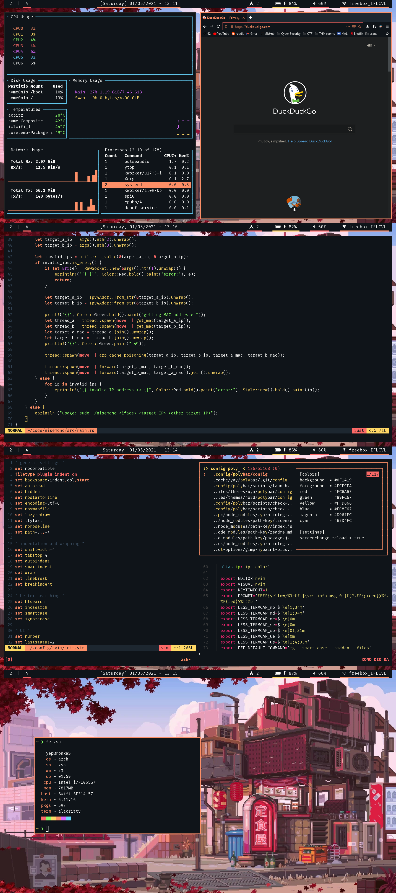
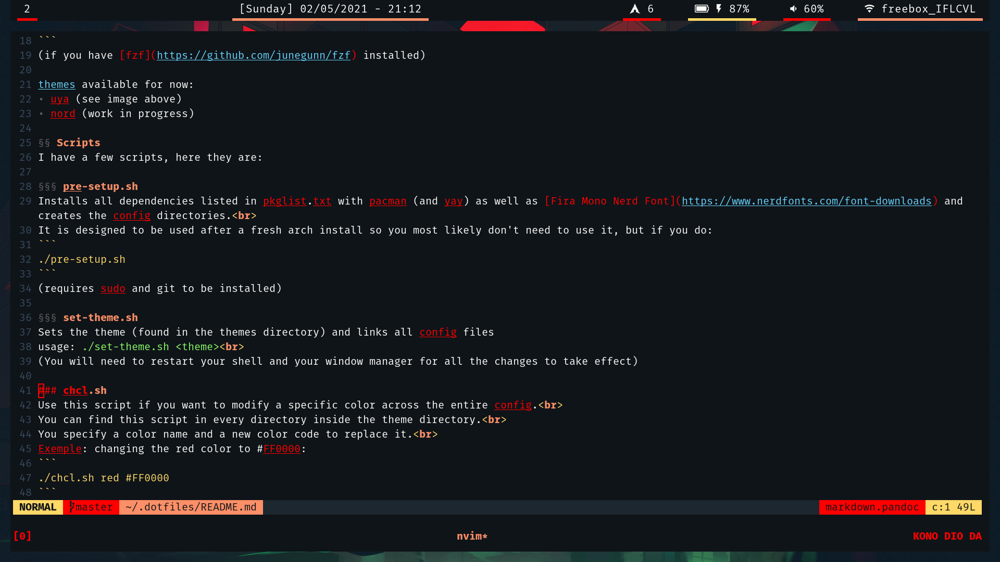

# dotfiles
Well, here are my dotfiles ...
- uya theme:


## Installation
```
git clone https://github.com/idontknowwhatimdoing/dotfiles ~/.dotfiles
cd ~/.dotfiles
```
then
```
./set-theme.sh <theme>
```
or just
```
./set-theme.sh
```
(if you have [fzf](https://github.com/junegunn/fzf) installed)

themes available for now:
* uya (see image above)
* nord (work in progress)

## Scripts
I have a few scripts, here they are:

### pre-setup.sh
Installs all dependencies listed in pkglist.txt with pacman (and yay) as well as [Fira Mono Nerd Font](https://www.nerdfonts.com/font-downloads) and creates the config directories.<br>
It is designed to be used after a fresh arch install so you most likely don't need to use it, but if you do:
```
./pre-setup.sh
```
(requires sudo and git to be installed)

### set-theme.sh
Sets the theme (found in the themes directory) and links all config files
usage: `./set-theme.sh <theme>`<br>
(restart your shell and window manager to apply all changes)

### chcl.sh
Use this script if you want to modify a specific color across the entire config.<br>
You can find this script in every directory inside the theme directory.<br>
You specify a color name and a new color code to replace it.<br>
Exemple: changing the red color to #FF0000:
```
./chcl.sh red #FF0000
```
(restart your shell and window manager to apply all changes)

Result (notice the that red changed everywhere (to become way uglier hehe)):

