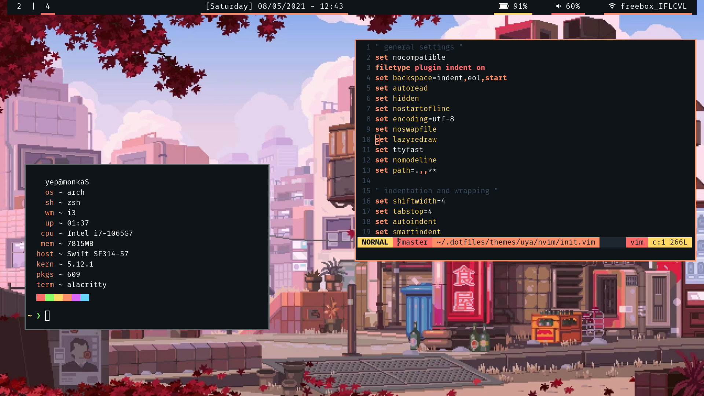
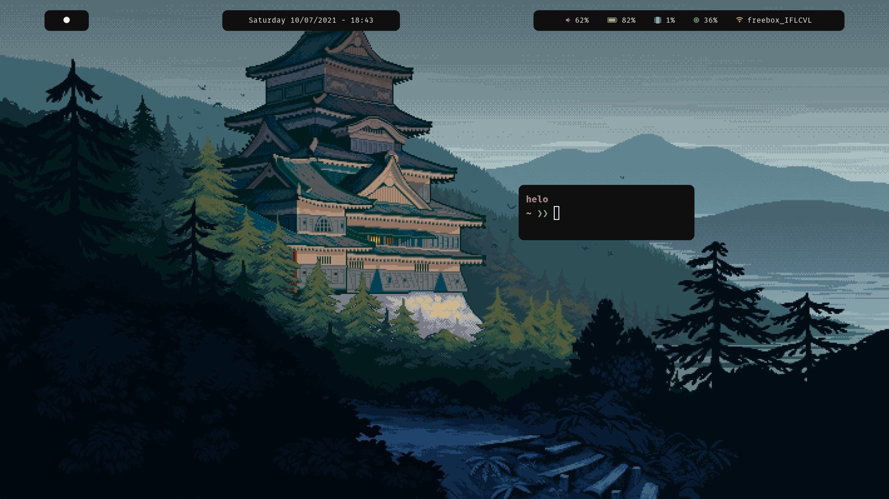
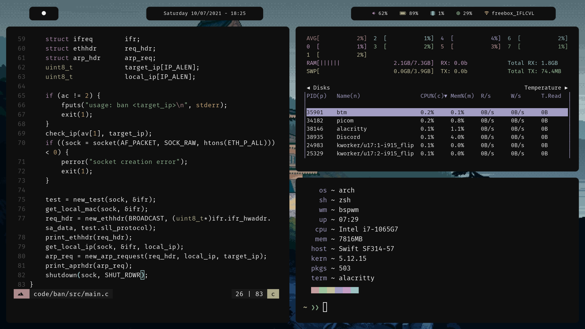
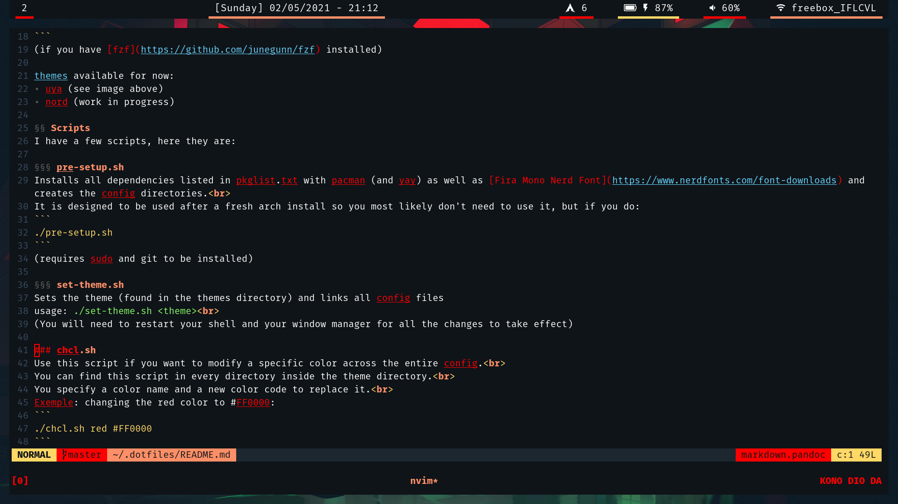

#  WARNING: very epic dotfiles 

## Themes

### - Uya (inspired by the [ayu theme](https://github.com/ayu-theme))


### -  [Mountain](https://github.com/pradyungn/Mountain) 



## Installation
```
git clone https://github.com/idontknowwhatimdoing/dotfiles ~/.dotfiles
cd ~/.dotfiles/scripts
./set-theme.sh [<theme>]
```
(see [below](#scripts))

## Scripts

### pre-setup.sh
Installs all dependencies listed in pkglist.txt with pacman (and yay) as well as [Fira Mono Nerd Font](https://www.nerdfonts.com/font-downloads) and creates the config directories.

It is designed to be used after a fresh Arch install so you most likely don't need to use it, but if you do:
```
./pre-setup.sh
```
(requires sudo and git to be installed and a non root user to be set up)

### set-theme.sh
Sets the theme (found in the [themes](https://github.com/idontknowwhatimdoing/dotfiles/tree/master/themes) directory) by linking all config files to their respective config folders.

If called without arguments, it will invoke [fzf](https://github.com/junegunn/fzf) to act as a selector.

Otherwise, specify the theme you want to set as an argument.

It will then restart bspwm to make sure all changes take effect
```
./set-theme.sh [<theme>]
```

### change-theme.sh
An other way of changing the theme, it uses [rofi](https://github.com/davatorium/rofi) to list the themes so you can use it outside the terminal.

It will call `set-theme.sh` with the selected theme.

Use a shortcut to call this script from your window manager (or sxhd) for maximum efficiency (wow).

There is currently a bug that makes the new picom config not reload. Not sure how to fix this.

If you think of a better name, let me know lmao
```
./change-theme.sh
```

### chcl.sh
Use this script if you want to modify a specific color across the entire theme config.

You can find this script in every directory inside the theme directory.

Specify a color name and a new color code to replace it.

Colors:
- red
- yellow
- green
- cyan
- blue
- magenta
- black
- white
- background
- foreground

Color code is in the format: `#RRGGBB`

Kinda useless but it can be nice when you want to mess around when making a new theme/rice.

Exemple: changing red to #FF0000:
```
./chcl.sh red #FF0000
```

Result:

notice that the red changed everywhere


## Todo
- Finish rofi themes - try to find a way to make the selected element bold but looks doomed
- Improve polybar setup (mountain) - looks pretty good
- Rewrite neovim config in Lua - once the api is a bit more complete
- Update screenshots
- Work on Discord themes
- Refactor some scripts
- Try out [Eww](https://github.com/elkowar/eww) (?)
