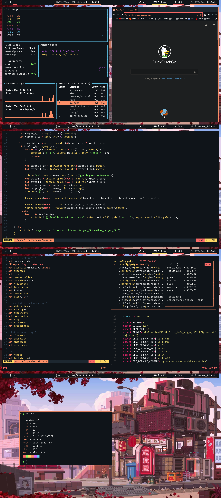

# dotfiles
Well, here are my dotfiles ...
- uya theme:


## Installation
```
git clone https://github.com/idontknowwhatimdoing/dotfiles ~/.dotfiles
cd ~/.dotfiles
```
then<br>
```
./set-theme.sh <theme>
```
or just
```
./set-theme.sh
``` (if you have fzf installed)<br>

themes available for now:
* uya (see showcase image)
* nord (work in progress)

## Scripts
I have a few scripts, here they are:

### pre-setup.sh
Installs all dependencies listed in pkglist.txt with pacman (and yay) as well as [Fira Mono Nerd Font](https://www.nerdfonts.com/font-downloads) and creates the config directories.<br>
It is desinged to be used after a fresh arch install so you most likely don't need to use it, but if you do: `./pre-setup.sh` (requires sudo and git to be installed)

### set-theme.sh
Sets the theme (found in the themes directory) and links all config files<br>
usage: `./set-theme.sh <theme>`<br>
(You will need to restart your shell and your window manager for all the changes to take effect)

### chcl.sh
You can find this script in every directory inside the theme directory.<br>
You specify a color name and a new color code to replace it.<br>
usage: `./chcl.sh <color name> <#RRGGBB>`<br>
exemple: `./chsl.sh red #FF0000`<br>
