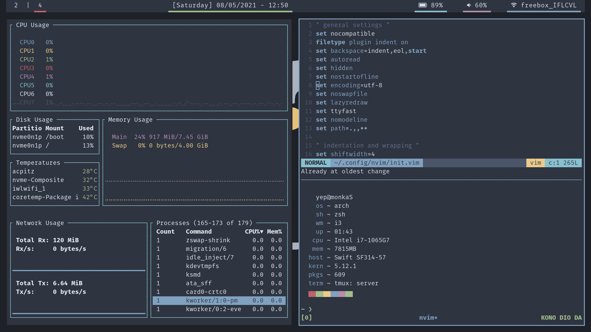

# dotfiles
Well, here are my dotfiles ...

## Themes

### Uya


### Mountain (check the [main repo](https://github.com/pradyungn/Mountain))


### Nord (work in progress)


## Installation
```
git clone https://github.com/idontknowwhatimdoing/dotfiles ~/.dotfiles
cd ~/.dotfiles
./set-theme.sh [<theme>]
```
(see [below](#scripts))

## Scripts

### pre-setup.sh
Installs all dependencies listed in pkglist.txt with pacman (and yay) as well as [Fira Mono Nerd Font](https://www.nerdfonts.com/font-downloads) and creates the config directories.

It is designed to be used after a fresh arch install so you most likely don't need to use it, but if you do:
```
./pre-setup.sh
```
(requires sudo and git to be installed)

### set-theme.sh
Sets the theme (found in the themes directory) by linking all config files to their respective config folders.

If called without arguments, it will invoke [fzf](https://github.com/junegunn/fzf) to act as a selector.

Otherwise, specify the theme you want to set as an argument.
```
./set-theme.sh [<theme>]
```
(restart your shell and window manager to apply all changes)

### chcl.sh
Use this script if you want to modify a specific color across the entire theme config.

You can find this script in every directory inside the theme directory.

Specify a color name and a new color code to replace it.

Exemple: changing red to #FF0000:
```
./chcl.sh red #FF0000
```
(restart your shell and window manager to apply all changes)

Result:

(notice the that red changed everywhere (to become way uglier hehe))

